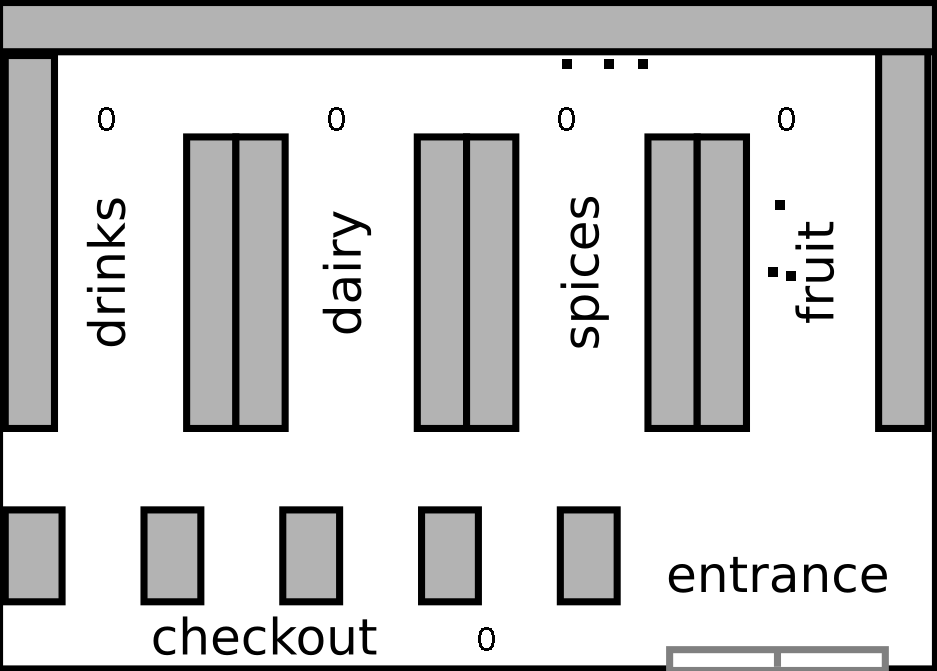

## markov_ki - Supermarket simulation
The project is collobaration of me and my colleagues Joseph and Uday fromm spiced Academy.

This python program simulates and visualizes customer's behavior such as the amount of time and money they spend at each aisle by applying the Markov Chain and Monte-Carlo modeling. The simulation can be based on any day of the week or on the whole weekdays with a given number of customers.

The program starts by asking the user to enter the specific day of the week from Monday to Friday or 'all_days' (a simulation based on all days of the week) and then the number of customers. The Monte-Carlo simulation using Markov Chain will run based on the given data and the program visualizes the shopping pattern of the customers with the amount of money they spend at each aisle and finally the total income of the supermarket at the checkout section.

## Usage
- run the week08_MCMC_project.py in the terminal

## Teck Stack:
- Python
- OpenCV
- Numpy
- Pandas

## Concepts
- Monte-carlo
- OOP

## License

Free software: [MIT](https://choosealicense.com/licenses/mit/)
License
  
